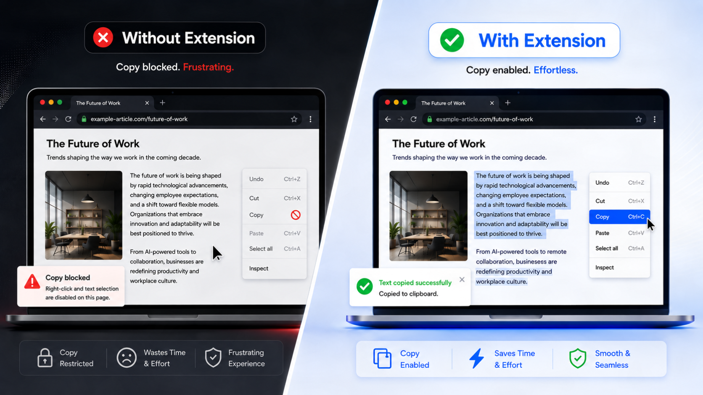

<div align="center">
  <h1>Unrestrict</h1>
  <p><strong>Take back selection, copy, paste, right-click, drag, and DevTools shortcuts on the sites you choose.</strong></p>
  <p>A local-first Chrome extension with per-site access, three protection profiles, and no network requests.</p>
</div>

<br>

<p align="center">
  
</p>

---

## Quickstart

Install Unrestrict in under a minute. No build step or dependencies are required.

1. **Download the extension.**

   Click **Code → Download ZIP**, then extract the archive. You can also clone the repository:

   ```bash
   git clone https://github.com/el1anbtw/Unrestrict.git
   ```

2. **Open Chrome Extensions.**

   Go to `chrome://extensions` in Chrome.

3. **Enable Developer mode.**

   Use the toggle in the top-right corner.

4. **Load Unrestrict.**

   Click **Load unpacked** and select the extracted repository folder containing `manifest.json`.

5. **Pin the extension.**

   Pin **Unrestrict** to the toolbar for quick access.

Open any site, click the Unrestrict icon, and enable **Remove restrictions**. Approve access when Chrome asks for it. The tab reloads once, and Unrestrict is ready to use.

## What it restores

- Native text selection and `user-select` behavior
- Copy, cut, and paste events
- The browser context menu
- Drag interactions
- Common DevTools shortcuts
- Selection hidden behind simple page overlays

Access is requested only when you enable a site. An optional global mode is available when you explicitly want Unrestrict to run across all HTTP and HTTPS pages.

## Protection profiles

| Profile | Best for | Behavior |
| --- | --- | --- |
| **Normal** | Most websites | Removes targeted restrictions while preserving as much page behavior as possible. |
| **Strong** | Aggressive event blockers | Isolates protected events, guards selection, and adds a fallback for blocked paste. |
| **Strong + anti-debug** | Sites that interfere with DevTools | Adds protection for DevTools shortcuts, `console.clear`, and short recurring debugger traps. |

Start with **Normal**. Strong profiles can interfere with custom menus or browser-based editors, so enable them only when the compatible profile is not enough.

## Privacy by design

Unrestrict is intentionally small and local:

- no analytics
- no network requests
- no remote code
- no blanket host permission at install time
- no background clipboard reading

Settings remain in Chrome extension storage. Site access is an optional permission and can be granted per hostname, including subdomains when requested.

## Limitations

Chrome does not allow extensions to inject into `chrome://` pages, the Chrome Web Store, or some built-in viewers. A regular extension also cannot universally recover content inside closed shadow roots, canvas elements, images, DRM media, static `debugger` statements, or pages governed by enterprise DevTools policies.

Cross-origin frames require permission for their own origin or global access. Some highly customized web apps may need a stronger profile, while others may work best with **Normal**.

## Project structure

```text
Unrestrict/
├── content/          page and isolated-world protection profiles
├── icons/            extension icons
├── lib/              shared settings logic
├── popup/            per-site controls
├── manifest.json     Manifest V3 configuration
└── service-worker.js permission, storage, and injection orchestration
```

---

<div align="center">
  <sub>Unrestrict only changes pages where you grant it access.</sub>
</div>
